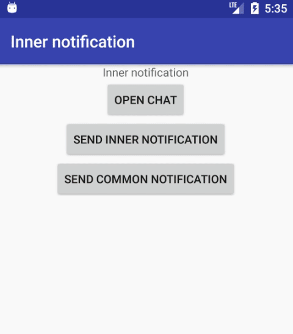

Inner notifications
===================

### What is it?
This is a simple library that works with notifications! User can *disable notification from settings, but application will still get them.*
The library can track your application activities and sending inner notifications if the application is in foreground.
This library also provides simple functionality for configuring and sending common push notification with *channel support(API 26 and higher)*



Download:
--------
Gradle
```groovy
dependencies {
  implementation 'io.inner.notification:inner_notification:0.1.1'
}
```
Maven
```maven
<dependency>
  <groupId>io.inner.notification</groupId>
  <artifactId>inner_notification</artifactId>
  <version>0.1.1</version>
  <type>pom</type>
</dependency>
```

Using
-------
For using you need to create application class and register NotificationApplicationCallback to application lifecycle:
```java
class SampleApplication: Application() {

    override fun onCreate() {
        super.onCreate()
        val managerConfig = ManagerConfig(
                appIcon = R.drawable.ic_android,
                color = R.color.application_color,
                defaultSettingsName = R.string.app_name,
                sound = R.raw.aud
        )
        registerActivityLifecycleCallbacks(NotificationApplicationCallback(this, managerConfig))
    }
}
```
For sending notification you need to create NotificationSender, configure it and call method __send()__. Example:
```java
NotificationSender("You have new message", Intent(context, ChatActivity::class.java))
    .setImage(R.drawable.image)
    .setText("How are you?")
    .send()
```
You can configure push with actions:
1) Open Application
```java
NotificationSender(R.string.default_new_message)
```
2) Url(or deeplink)
```java
NotificationSender(R.string.default_new_message, "yourappscheme://open_post")
```
3) Array of Intents
```java
NotificationSender(
    R.string.default_new_message,
    Intent(context, ConversationsActivity::class.java),
    Intent(context, ChatActivity::class.java)
)
```

Configuration
--------------
### Library config
To configure Notification library you need to create ManagerConfig before initialization. ManagerConfig fields:
* __innerNotificationEnabled: Boolean__ - used to send inner notifications, true by default
* __commonNotificationEnabled: Boolean__ - used to send common notification, true by default
* __isNeedsToAddLaunchActivity: Boolean__ - used to add launch activity(MainActivity), for opening common notification
* __sound: Int? (@RawRes)__ - raw res of your notification sound, null by default
* __defaultSettingsName: Int (@StringRes)__ - for Android O and higher, in settings user can configure notifications and their channel name by default
* __appIcon: Int (@DrawableRes)__ - res of your app icon
* __color: Int (@ColorRes)__ - resource background color of application icon
### Notification config
All configuration you need is available from NotificationSender
Otherwise you can create NotificationConfig and set it to NotificationSender
NotificationConfig fields:
* __innerNotificationEnabled: Boolean__ - is need to send inner notifications, true by default
* __commonNotificationEnabled: Boolean__ - is need to send common notification, true by default
* __color: Int (@ColorRes)__ - resource background color of application icon
* __appIcon: Int (@DrawableRes)__ - res of your app icon
* __sound: Int? (@RawRes)__ - raw res of your notification sound, null by default
*Priority of NotificationConfig is higher than ManagerConfig.*
### Identity
It's class for identifying you push notification:
NotificationIdentity fields:
* __id: Long__ - push id, by default the library creates the id from system timestamp
* __type: Type__ - contains information for channel support (type and user settings name)
* __priority: Priority__ - priority of your notification, used by notification and by the channel
### Excluding notifications
If you want to skip notification in some screen - you can exclude it by ExcludedRule. Example:
```java
//this code also available in Fragment
class SomeActivity: Activity() {

    override public fun onCreate(savedInstanceState: Bundle?) {
        //Kotlin example
        excludeWith {
             it.type.identifier == "chat"
        }
        //Java example
        NotificationExtensionKt.excludeWith(this, new ExcludedRule() {
              @Override
              public boolean isExcluded(@NotNull NotificationIdentity identity) {
                  return false;
              }
        });
    }
}
```
Add this code to enable notifications:
```java
excludeWith(null)
```

License
---------
MIT License

Copyright (c) 2019 Osipov Ilya (osipoff07)

Permission is hereby granted, free of charge, to any person obtaining a copy
of this software and associated documentation files (the "Software"), to deal
in the Software without restriction, including without limitation the rights
to use, copy, modify, merge, publish, distribute, sublicense, and/or sell
copies of the Software, and to permit persons to whom the Software is
furnished to do so, subject to the following conditions:

The above copyright notice and this permission notice shall be included in all
copies or substantial portions of the Software.

THE SOFTWARE IS PROVIDED "AS IS", WITHOUT WARRANTY OF ANY KIND, EXPRESS OR
IMPLIED, INCLUDING BUT NOT LIMITED TO THE WARRANTIES OF MERCHANTABILITY,
FITNESS FOR A PARTICULAR PURPOSE AND NONINFRINGEMENT. IN NO EVENT SHALL THE
AUTHORS OR COPYRIGHT HOLDERS BE LIABLE FOR ANY CLAIM, DAMAGES OR OTHER
LIABILITY, WHETHER IN AN ACTION OF CONTRACT, TORT OR OTHERWISE, ARISING FROM,
OUT OF OR IN CONNECTION WITH THE SOFTWARE OR THE USE OR OTHER DEALINGS IN THE
SOFTWARE.
